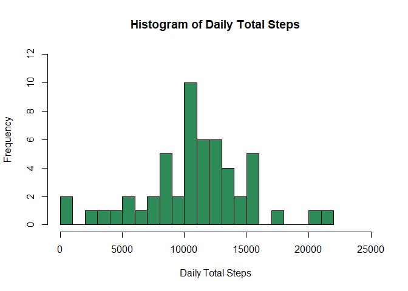
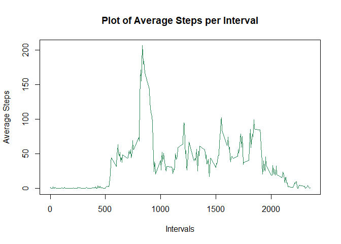
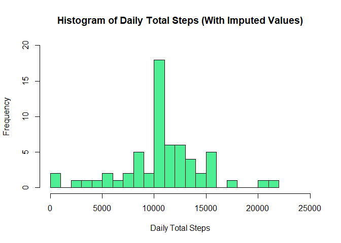
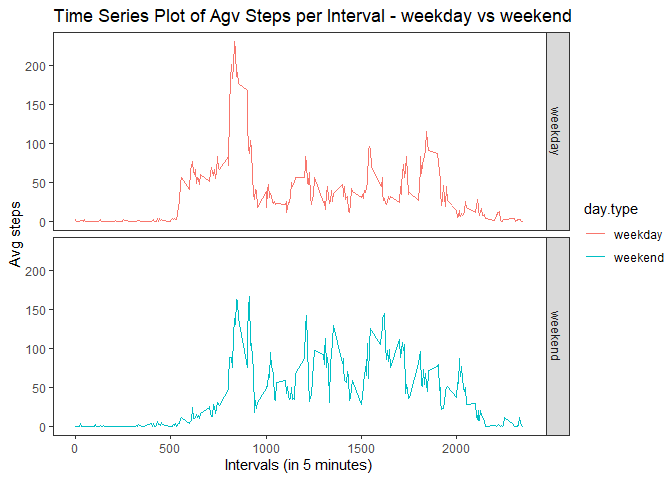

## Loading and preprocessing the data

**Unzipping, reading and pre-processing the data."activity.zip" should be available in the working directory.**

```r
unzip("activity.zip")
activity <- read.csv("activity.csv")
head(activity)
```

```
##   steps       date interval
## 1    NA 2012-10-01        0
## 2    NA 2012-10-01        5
## 3    NA 2012-10-01       10
## 4    NA 2012-10-01       15
## 5    NA 2012-10-01       20
## 6    NA 2012-10-01       25
```

```r
str(activity)
```

```
## 'data.frame':	17568 obs. of  3 variables:
##  $ steps   : int  NA NA NA NA NA NA NA NA NA NA ...
##  $ date    : chr  "2012-10-01" "2012-10-01" "2012-10-01" "2012-10-01" ...
##  $ interval: int  0 5 10 15 20 25 30 35 40 45 ...
```

```r
activity$date <- as.Date(activity$date,"%Y-%m-%d")
```


## What is mean total number of steps taken per day?


```r
library("dplyr")
```

**Calculating the total number of steps taken per day & plotting the Histogram of the total number of steps taken each day, while ignoring NA values.**

```r
totalStepsDaily <- activity[!(is.na(activity$steps)), ] %>% group_by(date) %>% summarize(total.steps=sum(steps))

hist(totalStepsDaily$total.steps,
     col="seagreen",
     xlim=c(0,25000),
     ylim=c(0,12),
     breaks=20,
     main="Histogram of Daily Total Steps",
     xlab="Daily Total Steps")
```

<!-- -->

**Calculating the mean and median of the total number of steps taken per day.**

```r
c(Mean=mean(totalStepsDaily$total.steps), Median=median(totalStepsDaily$total.steps))
```

```
##     Mean   Median 
## 10766.19 10765.00
```


## What is the average daily activity pattern?

**plotting 5-minute intervals (x-axis) and the average number of steps taken, averaged across all days (y-axis), while ignoring NA values.**

```r
avgStepsIntervals <- activity[!(is.na(activity$steps)), ] %>% group_by(interval) %>% summarize(avg.steps=mean(steps))

plot(avgStepsIntervals$interval, avgStepsIntervals$avg.steps,
     col="seagreen",
     type = "l",
     main="Plot of Average Steps per Interval",
     xlab="Intervals",
     ylab="Average Steps")
```

<!-- -->

**Getting the internal, which on average across all the days in the dataset, contains the maximum number of steps.**

```r
avgStepsIntervals[which.max(avgStepsIntervals$avg.steps),]$interval
```

```
## [1] 835
```


## Imputing missing values

**Checking & Reporting NA values.**

```r
colSums(apply(activity,2,is.na))
```

```
##    steps     date interval 
##     2304        0        0
```

**Filling missing data fields. Taking the mean for the 5-minute interval.**

```r
fillNA <- function(p.steps,p.interval){
  if (is.na(p.steps)) {
    ret <- subset(avgStepsIntervals,interval==p.interval)$avg.steps
  } else {
    ret <- p.steps
  }
  ret
}

calculated_list <- mapply(fillNA,activity$steps,activity$interval)

activity_filled <- mutate(activity,steps=calculated_list)
```

**Calculating the total number of steps taken per day & plotting the Histogram of the total number of steps taken each day, while ignoring NA values.**

```r
totalStepsDaily_filled <- activity_filled[!(is.na(activity_filled$steps)), ] %>% group_by(date) %>% summarize(total.steps=sum(steps))

hist(totalStepsDaily_filled$total.steps,
     col="seagreen2",
     xlim=c(0,25000),
     ylim=c(0,20),
     breaks=20,
     main="Histogram of Daily Total Steps (With Imputed Values)",
     xlab="Daily Total Steps")
```

<!-- -->

**Calculating the mean and median of the total number of steps taken per day.**

```r
c(Mean=mean(totalStepsDaily_filled$total.steps), Median=median(totalStepsDaily_filled$total.steps))
```

```
##     Mean   Median 
## 10766.19 10766.19
```

**We observe that the mean still remains the same as it was without imputing the missing data. Whereas, there is a slight increase in the median because of imputing the missing data.**


## Are there differences in activity patterns between weekdays and weekends?

**Adding a new factor variable in the data-frame with imputed missing values. This column would tell if the date is a weekday or a weekend.**

```r
wkday_wkend <- as.factor(
  as.character(
    lapply(weekdays(activity_filled$date),
           function(x) if (x %in% c("Sunday","Saturday")) {"weekend"} else {"weekday"}
    )
  )
)

activity_filled <- mutate(activity_filled,day.type=wkday_wkend)
```

**Making a time series plot of the 5-minute interval (x-axis) and the average number of steps taken, averaged across all weekday days or weekend days (y-axis)**

```r
library("ggplot2")
```


```r
avgSteps_dayType_Intervals <- activity_filled %>% group_by(day.type,interval) %>% summarize(avg.steps=mean(steps))
```

```
## `summarise()` has grouped output by 'day.type'. You can override using the `.groups` argument.
```

```r
g <- ggplot(avgSteps_dayType_Intervals,aes(interval,avg.steps,col=day.type))

g + 
  geom_line() + 
  facet_grid(day.type~.) + 
  labs(title="Time Series Plot of Agv Steps per Interval - weekday vs weekend",x="Intervals (in 5 minutes)", y="Avg steps") +
  theme_test()
```

<!-- -->
